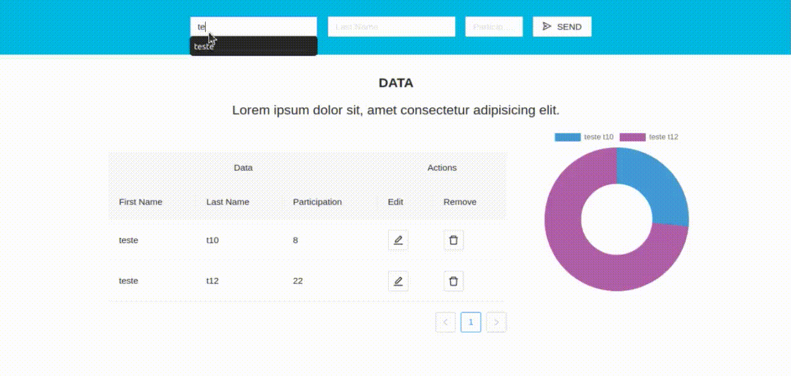

# t10Assessment

## Built with
* [Node.js](https://nodejs.org/en/)
* [React.js](https://reactjs.org/)
* [Typescript](https://www.typescriptlang.org/)
* [StyledComponents](https://styled-components.com/)
* [Firebase](https://firebase.google.com/)

## Running the project
This is a [React.js](https://reactjs.org/) project bootstrapped with [`create-react-app`](https://reactjs.org/docs/create-a-new-react-app.html).

## Configure it!
Inside the following path put your .env file
#### `api/functions/`
put your `.env` && follow the 
#### `api/functions/.env.example`

Inside the following path put your config.ts file
#### `cli/src/config/`
put your `.env` && follow the 
#### `cli/src/config/example.config.ts`

## If you want to request my configuration files where there's my database url just request on my social medias [ask me!](https://github.com/Guilherme-del/Guilherme-del). I didn't left my conf files on repo because of [Security](https://firebase.google.com/docs/firestore/security/get-started).

## Run it!
As it's an serverless api you just have to provide the url link as shown on configure it section , but if you want to run it on development mode [check it out!](https://firebase.google.com/docs/emulator-suite) 

In the client directory, you can run:
#### `npm i`
#### `npm start`

It runs the app in the development mode. 
Open [http://localhost:3000](http://localhost:3000) to view it in the browser. 

* [Todo](https://github.com/Guilherme-del/t10Assessment/issues)
